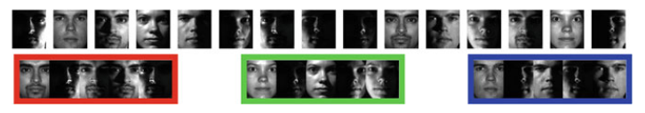
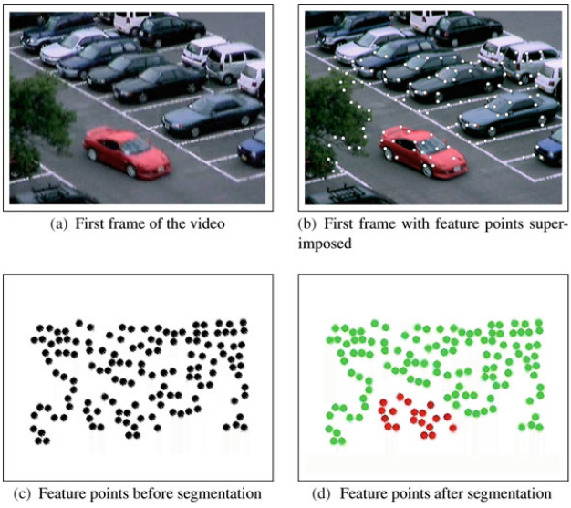
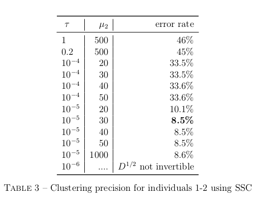
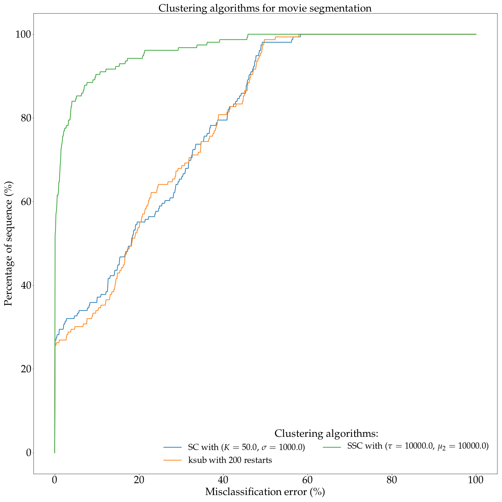

# Face clustering and motion segmentation

Second project given as part of the following course: *Unsupervised learning*, fall 2017-2018, MSc MVA, ENS Paris-Saclay.

## Introduction

### Face clustering

Consider the problem of clustering face images of multiple individuals acquired with a fixed pose and varying illumination. The goal is to cluster the faces, each of one belonging to a given individual, as shown in the following figure, extracted from _Vidal et al, 2016_



### Motion segmentation

Consider a video sequence in which a camera observes n distinct points. The goal is to cluster the points, each of one have a relative motion, as shown in the following figure, extracted from _Vidal et al, 2016_:



## Data

The data are available online, thanks to the The Vision, Dynamics and Learning Lab of John Hopkins University.

If you already have downloaded data, please skip the `download` subsection and proceed to the creation of symbolic link as suggested in `symbolic link` subsection

### Download

To download the data as required by the notebooks, you have to proceed as follow:

```
wget -O data/ExtendedYaleB.mat "http://www.vision.jhu.edu/gpca/fetchcode.php?id=210?ExtendedYaleB.mat"
```

```
wget -O data/Hopkins155 "http://www.vision.jhu.edu/data/fetchdata.php?id=1?Hopkins155.zip"
```

You can now skip the following subsection to create symbolic links

### Creation of symbolic links

If you already have downloaded or two of the datasets, you can create your own symbolic link, or use the corresponding `tools/link_{extended_yale_b,hopkins155}.sh` script to properly create a fresh link in the required `data/` directory.

To use `link_hopkins155.sh`, just enter:
```
bash tools/link_hopkins155.sh
```

## Results

You can find all results in the report provided with the repository in `report` directory. Here are extracted two figures from the `report/report.pdf` file:

### Face clustering



### Motion segmentation




## Bilbiography

@book{vidal2016PCA,
	title={Generalized Principal Component Analysis},
	author={Vidal, Ren{\'e} and Ma, Yi and Sastry, S Shankar},
	year={2016},
	publisher={Springer}
}
